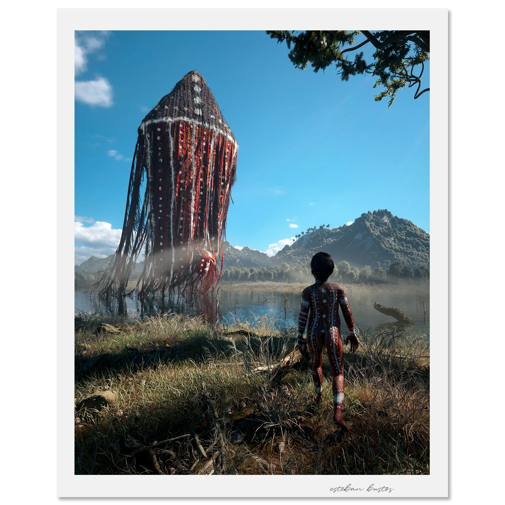
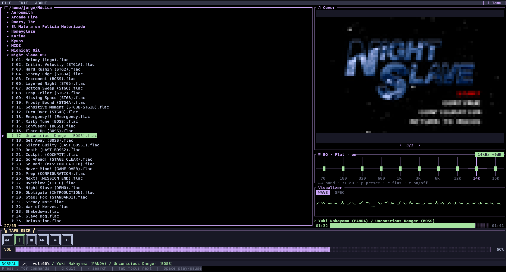

# Tanu

 photo by [Ebustos](https://estebanbustos.com/products/tanu?srsltid=AfmBOoozUW3g4BeDI7p6OIXNbmj2xMCP4DwPspE4_uUeaysFOH-MX1nU)

A terminal music player written in Rust — a file-browser–first player inspired
by [cmus](https://cmus.github.io/), with a [ratune](https://github.com/acmagn/ratune)-style
layout and a [ratatui-explorer](https://github.com/tatounee/ratatui-explorer)-style
file explorer.

Browse your filesystem, hit Enter to play, watch a real-time oscilloscope fed
from the actual audio, see the embedded album art, and drive everything from a
radio-cassette transport deck — keyboard or mouse.

```
┌ FILE  EDIT  ABOUT             ───────────────────────────| ♪ Tanu |──┐
│ 🗀 ~/Music                          │ ♫ Cover                        │
│ ⤴  ..                               │  ▄▄▄▄▄▄▄▄▄▄▄▄                  │
│ ▸  Albums                           │  ██ album art ██               │
│ ▶ ♪ track-01.flac                   ├────────────────────────────────┤
│   ♪ track-02.flac                   │ ≣ EQ · Rock · on    1kHz +3dB  │
│   ...                               │ ▁▃█▅▂ │▂▄█▅  60Hz▸▸▸ 16k       │
│                                     ├────────────────────────────────┤
│                                     │ WAVE  SPEC      /\  /\  /\     │
│                                     ├────────────────────────────────┤
│                                     │ ♪ Artist / Title               │
│                                     │  00:42 ██████░░░░░ 03:15       │
├─────────────────────────────────────┴────────────────────────────────┤
│ ▚ TAPE DECK ▞                                                        │
│  ╔═══╗╔═══╗╔═══╗╔═══╗╔═══╗╔═══╗                                      │
│  ║ ◀◀║║ ▶ ║║ ■ ║║ ▶▶║║ ⇄ ║║ ↻ ║                                     │
│  ╚═══╝╚═══╝╚═══╝╚═══╝╚═══╝╚═══╝    VOL ▐▓▓▓▓░░░▌  80%                │
└──────────────────────────────────────────────────────────────────────┘
```

## Features

- **File explorer** — an expandable directory tree (dirs expand in place),
  media files only, icons, selection marker, incremental search, hidden-file
  toggle. Keyboard + mouse. Playing a file queues its folder in tree order so
  Prev/Next step through it.
- **Instant playback** — streaming decode via rodio; playback starts in
  microseconds (no full-file decode up front).
- **Visualizer** — a panel with two views you switch between (WAVE/SPEC tabs or
  `m`): a real oscilloscope drawn from the samples actually playing, and a
  16-band Goertzel spectrum analyzer with color-graded bars.
- **10-band graphic equalizer** — real DSP that modifies the sound (cascaded RBJ
  peaking biquads, ±12 dB), Winamp-style sliders with presets, between the cover
  and the scope. Drag a slider or use `←→` / `↑↓`; `p` cycles presets, `e` on/off.
  A numeric monitor shows the band you're moving (freq + signed dB).
- **Seek strip** — under the visualizer: the now-playing track name plus a
  `00:42 ████░░ 03:15` bar. Click or drag it to jump anywhere in the track.
- **Album art** — folder images first (a file named `cover` always wins), else
  the largest embedded cover; rendered as a half-block mosaic, aspect-preserved
  and Lanczos3-scaled (no image protocol needed; works in any terminal). When the
  folder holds several images, a `‹ i/n ›` bar pages left/right (click the arrows
  or scroll the wheel over the cover).
- **Radio-cassette transport deck** — prev / play-pause / stop / next /
  shuffle / repeat and a horizontal volume bar. All clickable. (Playback
  progress lives in the seek strip under the visualizer.)
- **Menus** — FILE (open file / scan folder via a tree picker with OK-Cancel /
  quit), EDIT (sound source,
  Text Color — a centered modal palette with colored swatches; the pick retints
  tanu's whole UI: borders, tree, tape deck, titles), ABOUT.
- **Formats** — MP3, FLAC, OGG, Opus, WAV, M4A (via symphonia). MIDI (`.mid`)
  plays through `fluidsynth` + a SoundFont — install fluidsynth and point
  `$TANU_SOUNDFONT` at a `.sf2` (else tanu searches common SoundFont dirs).
- **Responsive** — adapts from a 5" screen upward.

## Build & run

Requires a recent Rust toolchain and an audio output (ALSA on Linux).

```sh
cargo build --release
cargo run --release -- [MUSIC_DIR ...]
```

With no arguments, tanu opens your saved library folder (or your system audio
directory). Set a start folder from **FILE → Library Folder…**.

Logs go to `~/.local/share/tanu/tanu.log` (never stdout — the TUI owns the
terminal). Follow them with `tail -f ~/.local/share/tanu/tanu.log`.

## Keys

| Key | Action |
|-----|--------|
| `↑`/`k`, `↓`/`j` | Move selection |
| `→`/`l` | Expand directory / descend |
| `Enter` | Toggle directory / play file |
| `←`/`h`/`Backspace` | Collapse directory / go to parent |
| `◀◀` / `▶▶` (or Prev/Next) | Previous / next media file in the folder |
| `Space` | Play selected (if idle) / pause-resume |
| `+` / `=` / `-` | Volume up / down |
| EQ: `←`/`→` band, `↑`/`↓` ±dB | Adjust the focused equalizer band |
| EQ: `p` / `r` / `e` | Cycle preset / flat / on-off |
| Visualizer: `m` or `Tab` | Toggle WAVE / SPEC view |
| `/` | Incremental search (Esc cancels, Enter keeps filter) |
| `Ctrl+H` | Toggle hidden files |
| `Home`/`g`, `End`/`G`, `PgUp`/`PgDn` | Jump / page |
| `:` | Command mode |
| `q`, `Ctrl+C`, `Ctrl+Q` | Quit |

Mouse: click to select, double-click to play/enter, right-click for a context
menu, scroll to navigate. Click the transport keys, the volume bar, the seek
strip (drag to scrub), the menu items, and the `| ♪ Tanu |` brand (opens About).

## Commands (`:`)

`play` · `pause` · `stop` · `next` · `previous` · `toggle` · `volume <0-100>` ·
`seek <s>` · `shuffle on|off` · `repeat off|track|playlist` · `rescan` ·
`theme <name>|list` · `layout <name>|list` · `set <key> <value>` ·
`library_folder` · `open_file` · `scan_dir` · `about` · `quit`

`:set` persists to `config.toml` — keys: `theme`, `volume`, `library`, `max_fps`.

## Config

`~/.config/tanu/config.toml` (created on first `:set` / library-folder change).
Themes and key bindings live under the same directory.

## Development

```sh
cargo test              # unit + doctests
cargo build --all-targets
cargo bench             # criterion (db_benchmark)
```

Optional feature flags: `http-plugins` (reqwest), `wasm-plugins` (wasmtime).

**Versioning** — `build.rs` stamps `TANU_VERSION` as `v<major>.<minor>.<build>`
(major/minor from `Cargo.toml`, build auto-incremented every build and stored in
the gitignored `.build_number`), e.g. `v1.12.193`. Shown in the About modal.

See [`docs/roadmap.md`](docs/roadmap.md) for what's done and what's next, and
[`docs/adr.md`](docs/adr.md) for architecture decisions.

## Packaging / releases

One command builds every Linux package — `.deb` + `.rpm` for x86_64, arm64, and
armv7 — into `./dist`, showing a step progress bar:

```sh
cargo install cargo-deb cargo-generate-rpm cross   # one-time
scripts/release.sh                                  # needs Docker for the ARM targets
```

```text
Building tanu release packages → ./dist
[############------------------]  44% (4/9) aarch64: .deb
```

Native x86_64 builds with `cargo`; the ARM targets cross-compile through `cross`
(Docker) — `Cross.toml` installs the target-arch ALSA dev libs in the build
container. Package contents/deps are declared under `[package.metadata.deb]` and
`[package.metadata.generate-rpm]` in `Cargo.toml` (ALSA is an automatic
dependency; `fluidsynth` is recommended for MIDI). Output:

```text
tanu_1.12.0-1_amd64.deb   tanu-1.12.0-1.x86_64.rpm
tanu_1.12.0-1_arm64.deb   tanu-1.12.0-1.aarch64.rpm
tanu_1.12.0-1_armhf.deb   tanu-1.12.0-1.armv7hl.rpm
```

## Layout



## License

[MIT](LICENSE) Copyright (c) 2026 Jorge Codelia
