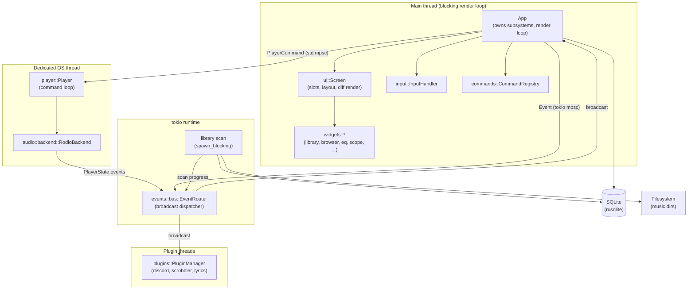
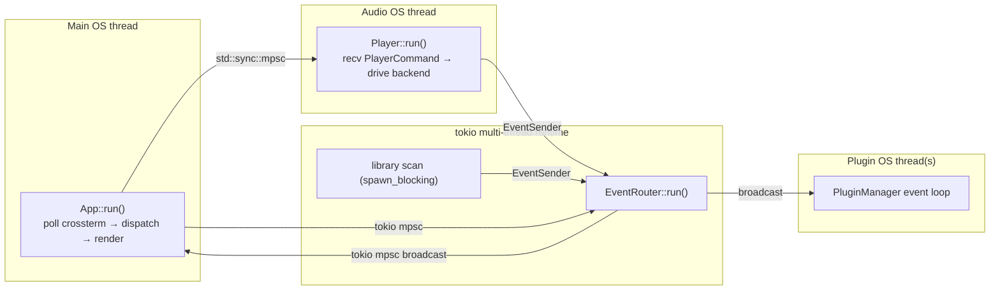
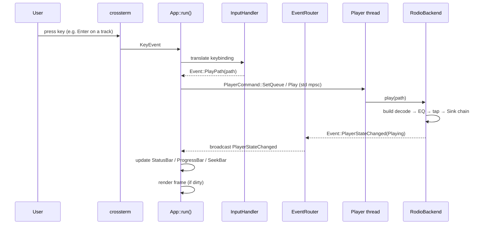
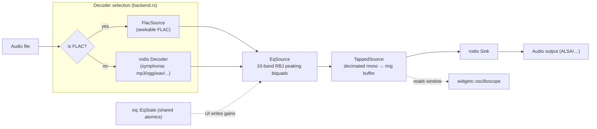
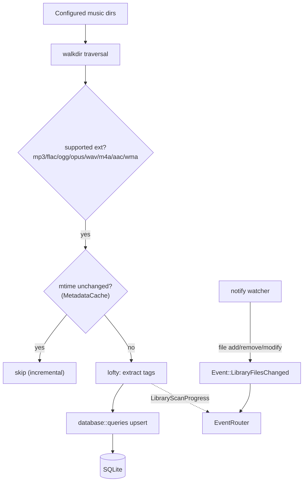
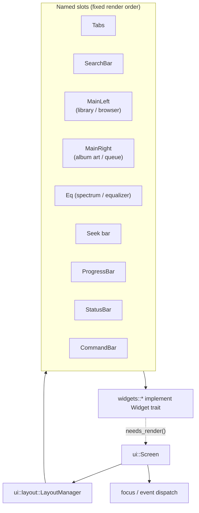

# Tanu Architecture

Tanu is a terminal music player (a cmus-inspired TUI) built on `ratatui` +
`crossterm` for the UI, `symphonia`/`rodio` for audio, and `rusqlite` for
library persistence. This document describes how the pieces fit together, the
threading model, and the main data flows.

## 1. High-level overview

Tanu is organized as a set of loosely-coupled subsystems that communicate
almost exclusively through a typed **event bus**. The `App` struct owns the
top-level subsystems and drives a blocking render loop on the main thread,
while background work (event routing, audio playback, library scanning,
plugins) runs on separate threads or `tokio` tasks.



## 2. Threading model

`rodio::OutputStream` is not `Send` on Linux (ALSA), so audio playback cannot
live inside the async runtime. Tanu therefore splits work across three kinds of
execution context:



| Context | What runs there | Why |
|---------|-----------------|-----|
| Main OS thread | `App::run()` render loop — polls crossterm, dispatches events, renders frames | `ratatui`/`crossterm` own the terminal; the loop is blocking |
| tokio runtime | `EventRouter`, library scan (`spawn_blocking`), forwarding tasks | Async I/O, concurrency, channel plumbing |
| Audio OS thread | `Player::run()` command loop + `RodioBackend` | `rodio::OutputStream` is `!Send` on Linux |
| Plugin thread(s) | Built-in plugins reacting to events | Isolate plugin work (network calls, Discord IPC) from the UI |

### Channel types

- **UI ↔ Router:** `tokio::sync::mpsc::UnboundedSender<Event>` (see
  `events/bus.rs`). Components publish via a cloned `EventSender`; the router
  broadcasts to all registered listeners.
- **UI → Player:** `std::sync::mpsc` carrying `PlayerCommand`. Synchronous,
  matches the blocking audio thread.
- **Player/Scan → UI:** an `EventSender` handed into the audio thread and scan
  task so they can emit `PlayerStateChanged` / `LibraryScan*` events back onto
  the bus.

## 3. Event system

Everything routes through one typed sum type, `events::Event`. Each subsystem
emits and consumes variants of it; the `EventRouter` is a simple fan-out
dispatcher that reads from one input channel and rebroadcasts to every
registered listener.



The `Event` enum spans playback control (`Play`, `Pause`, `Seek`, `Next`…),
library lifecycle (`LibraryScanStarted`, `LibraryScanProgress`,
`LibraryFilesChanged`…), playlist/queue mutations, and UI concerns
(`KeyPress`, `MouseAction`, `Resize`, `Command`). Keeping one global enum means
any component can observe any event without bespoke wiring.

## 4. Audio pipeline

Playback is a lazy `rodio::Source` chain so playback starts instantly and
processing happens sample-by-sample as audio plays. The backend builds the
chain per track and hands it to a `Sink`.



Key points:

- **EQ:** `EqState` holds the ten band gains as shared atomics. The UI writes
  them; the audio thread reads them inside `EqSource`, so slider changes affect
  the sound in real time. Frequencies match Winamp's classic 10-band layout.
- **Visualization:** `TappedSource` pushes a decimated mono copy of the actual
  played samples into a small ring buffer, which the oscilloscope widget reads —
  the trace is the real signal, not a synthetic one.
- **FLAC:** gets its own `FlacSource` because in-place seeking isn't supported
  by the default decode path; seeking rebuilds the chain with a skip.
- **MIDI:** `.mid`/`.midi` files are rendered offline to a temporary WAV via
  `fluidsynth` (using the selected SoundFont), then fed through the *same*
  pipeline — so EQ, seek, and visualization all work uniformly.

## 5. Library & database

The library subsystem walks the configured music directories, extracts metadata
with `lofty`, and persists tracks to SQLite. Scans run on `spawn_blocking` and
report progress via the event bus; a `notify` watcher keeps the index live.



- **Database** (`database/mod.rs`) is an `Arc<Mutex<Connection>>` clonable
  handle. Schema and migrations live in `database/migrations.rs`; queries in
  `database/queries.rs`. All access happens off the async runtime via
  `spawn_blocking`.
- **Incremental scans** use mtime via `MetadataCache` to skip unchanged files.

## 6. UI & rendering

The UI is a **slot-based composition** with differential rendering — the loop
only redraws when a widget is dirty or a user event arrived.



Each widget implements the `Widget` trait and reports whether it needs a
redraw. `Screen` assigns widgets to named `Slot`s, `LayoutManager` computes
their rects, and rendering walks slots in a fixed order. Popups, context menus,
and the directory picker overlay on top.

## 7. Extensibility

### Plugins

Plugins implement the `Plugin` trait and register with a `PluginManager`, which
hands each a `PluginContext` granting controlled access to app services. The
lifecycle is:

```
register → on_init(ctx) → [on_event(ctx, event), on_tick(ctx)]… → on_shutdown()
```

Built-in plugins live under `plugins/builtin/`:

| Plugin | Purpose |
|--------|---------|
| `discord` | Discord Rich Presence ("now playing") |
| `scrobbler` | Last.fm scrobbling |
| `lyrics` | Lyrics fetch/display |

A WASM plugin host lives under `plugins/wasm/` for future third-party plugins.

### Other seams

- **`AudioBackend` trait** (`player/mod.rs`) abstracts playback; `RodioBackend`
  is the production impl, `StubAudioBackend` supports tests.
- **Core traits** (`core/traits.rs`): `Component`, `AsyncComponent`,
  `Pausable`, `Command` — the shared vocabulary every subsystem implements.
- **Config / theme / i18n** are data-driven (`config/`, `theme/`, `i18n/`),
  with default keybindings in `config/mod.rs`.

## 8. Module map

| Module | Responsibility |
|--------|----------------|
| `app` | Runtime: owns subsystems, terminal, and the main render loop |
| `events` | Global `Event` enum + `EventRouter` broadcast bus |
| `player` | Playback engine + `AudioBackend` trait, runs on its own thread |
| `audio` | Backend, decoders, EQ, ReplayGain, visualization tap |
| `database` | SQLite persistence (schema, migrations, queries) |
| `library` | Directory scan, metadata extraction, fs watching |
| `ui` | Screen composition, slots, layout, differential render |
| `widgets` | Concrete UI widgets (library, browser, eq, scope, bars…) |
| `input` | Keybinding translation |
| `commands` | Command registry (`:`-style commands) |
| `queue` / `playlist` | Playback queue and playlists |
| `plugins` | Plugin API + built-ins + WASM host |
| `config` / `theme` / `i18n` | Configuration, theming, localization |
| `core` | Foundational traits and typed IDs |
| `browser` / `search` / `services` / `mouse` | Supporting subsystems |

> Note: `lib.rs` marks the crate `#![allow(dead_code)]` — several subsystems
> (plugins, playlists, search, browser) are implemented but not yet fully wired
> into `app`.
