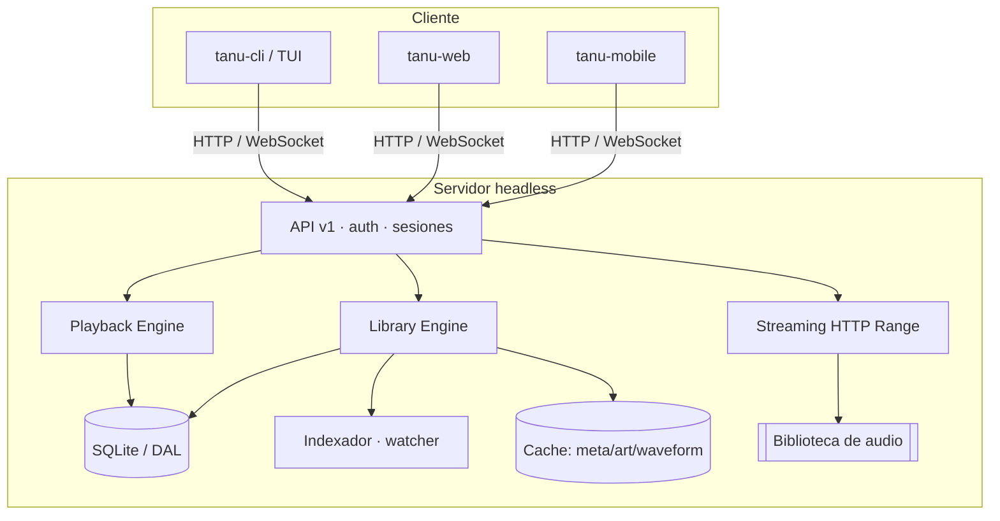

# Tanu Roadmap — de reproductor local a plataforma Cliente/Servidor

Este roadmap se deriva de [`docs/CODE_REFACTOR_PROMPT.md`](CODE_REFACTOR_PROMPT.md):
evolucionar Tanu desde una app TUI local hacia una **plataforma distribuida
multiusuario** (servidor headless + clientes remotos) accesible sobre
**Tailscale**, al estilo Navidrome / Jellyfin / Spotify Connect para homelab.

Principio rector: **la TUI nunca vuelve a tocar el filesystem directamente** —
siempre habla con el servidor. El código local actual se convierte en la base
del cliente (`tanu-cli`) y del motor que corre en el servidor.

---

## Estado base (hoy) — TUI local ✅

Punto de partida ya funcionando. Se **reutiliza**, no se tira.

- [x] Explorador de archivos en árbol (media-only, expand/collapse, teclado+mouse).
- [x] Reproducción: rodio streaming (arranque ~0.5ms), cola por directorio,
      auto-advance, repeat/shuffle, stop conserva cola.
- [x] Visualizador con dos vistas conmutables (tabs `WAVE`/`SPEC`): osciloscopio
      real en el playhead + analizador de espectro de 16 bandas (Goertzel).
- [x] **Ecualizador grafico de 10 bandas** que modifica el sonido (biquads RBJ
      peaking en cascada, ±12 dB, presets estilo Winamp) + album art HD
      (half-blocks, aspecto preservado, Lanczos3).
- [x] Transport deck con volumen; menús FILE/EDIT/ABOUT; layout responsivo.
- [x] SQLite (tracks/albums/artists/FTS5/playlists), escáner lofty incremental.
- [x] Config TOML, logging a archivo, plugins (scrobbler/discord/lyrics/WASM).

> Deuda técnica a resolver en Fase 1: acoplamiento entre `App` (UI) y
> `player`/`library`/`database` (acceso directo a FS y DB desde la TUI),
> cola global en el player, estado en memoria.

---

## Fase 1 — Refactor + separación núcleo/UI 🔜

Objetivo: desacoplar para poder mover la lógica al servidor sin reescribir.

- [ ] Aplicar Clean Architecture: capas `domain` / `services` / `repository` /
      `transport`. Interfaces pequeñas, DI, bajo acoplamiento.
- [ ] **Repository Pattern** sobre SQLite (DAL) para migrar luego a Postgres/MariaDB.
- [ ] Extraer traits de motor: `Player`, `QueueManager`, `OutputDevice`,
      `Decoder`, `Resampler` (múltiples implementaciones).
- [ ] Separar el **indexador** del reproductor; watcher por eventos de FS
      (inotify/FSEvents/ReadDirectoryChangesW).
- [ ] Definir el **contrato de API v1** (OpenAPI) antes de implementar.
- [ ] Binario nuevo `tanu-server` (headless) + `tanu-cli` (la TUI actual como cliente).
- [ ] API REST inicial: Library / Albums / Artists / Tracks / Search / Playback / Health.

## Fase 2 — Multiusuario + persistencia 🔜

- [ ] Modelos: Users, Tracks, Albums, Artists, Playlists, PlaylistTracks,
      Favorites, History, Sessions, Devices, Scans, Configuration.
- [ ] Autenticación usuario/password con **Argon2/bcrypt** (nunca texto plano).
- [ ] Cola, historial, shuffle/repeat, posición **por usuario** (no cola global).
- [ ] Playlists y favoritos por usuario; preferencias persistidas.
- [ ] Escalabilidad: paginación, lazy loading, índices SQL, FTS5 (migrable a
      Meilisearch/Typesense). Diseñar para miles de álbumes, sin cargar todo en RAM.

## Fase 3 — Streaming + tiempo real 🔜

- [ ] **Streaming HTTP** con Range Requests, seeking, buffering, progresivo
      (nunca cargar la canción completa en memoria).
- [ ] **WebSocket / gRPC streaming** para eventos: Now Playing, Queue Updated,
      Playback Changed, Volume, Pause/Resume, Client Connected/Disconnected.
      Sin polling.
- [ ] Cola remota + sincronización de reproducción/volumen/estado entre sesiones
      (Laptop, Desktop, SteamDeck, Phone).
- [ ] Cache: metadata, album art, thumbnails, waveform, search.

## Fase 4 — Despliegue + observabilidad 🔜

- [ ] `Dockerfile` + `docker-compose.yml` (persistencia por volúmenes) y unidad
      `tanu.service` (systemd).
- [ ] Config YAML/TOML: `server.port`, `library`, `database`, `cache`,
      `authentication`, `streaming`, `tailscale`.
- [ ] Logging estructurado JSON con niveles; endpoints `/metrics` `/health`
      `/ready` compatibles con Prometheus.
- [ ] Funcionar 100% sobre **Tailscale** (`http://100.x.x.x:PORT` o
      `tanu.tailnet.ts.net`), sin abrir puertos públicos ni NAT manual.

## Fase 5 — Ecosistema 🔜

- [ ] Auth avanzada: OAuth2, OIDC, Tailscale Identity, Auth Proxy.
- [ ] Clientes `tanu-web` y `tanu-mobile` (Android/iOS/Raspberry Pi).
- [ ] gRPC, plugins, clusterización ligera.
- [ ] Futuro: transcodificación, Chromecast/AirPlay/DLNA/Sonos, federación,
      múltiples bibliotecas/servidores.

---

## Seguridad (transversal)

Nunca asumir red confiable: autenticación + autorización, rate limiting, CORS
configurable, CSRF cuando aplique, validación de entrada, límites de tamaño,
timeouts.

## Entregables (según el prompt)

Análisis de arquitectura actual · mapa de acoplamientos/deuda · arquitectura
objetivo con diagramas Mermaid · plan de migración incremental · `tanu-server` ·
cliente `tanu` · API REST documentada (OpenAPI) · tiempo real (WS/gRPC) ·
SQLite con DAL desacoplado · auth + sesiones · streaming con Range Requests ·
Docker/Compose/systemd · pruebas unitarias/integración/benchmarks · docs +
ADRs + guía de despliegue homelab con Tailscale.

## Criterios de éxito

Un servidor centraliza la biblioteca · múltiples clientes simultáneos por
Tailscale · sesiones/colas/preferencias independientes por usuario · evolución a
web/móvil/TUI sin tocar el núcleo · diseño mantenible y desacoplado (Clean
Architecture).

---

Estado actual: TUI local ✅ (`cargo test` — 113 tests, 0 warnings).
Fases 1–5: pendientes.
